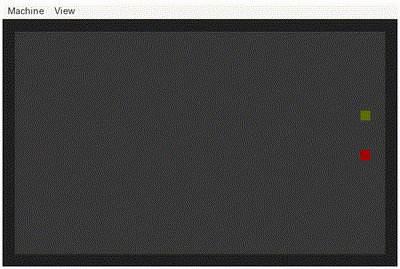
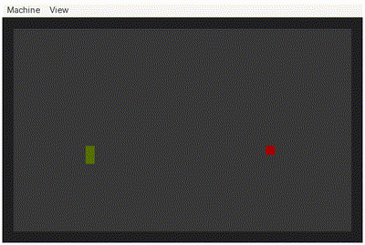

# boot-snake

A snake game that fits into a single 512-byte boot sector, written in x86 real mode assembly.

## Demo

 | 

## How to play

### 1. Requirements

You need to have `nasm` and `qemu` installed on your system.

### 2. Clone the repo

```bash
git clone https://github.com/un4rchh/boot-snake
cd boot-snake
```

### 3. Start the game

```bash
nasm -f bin snake.asm -o snake.bin && qemu-system-x86_64 -drive format=raw,file=snake.bin
